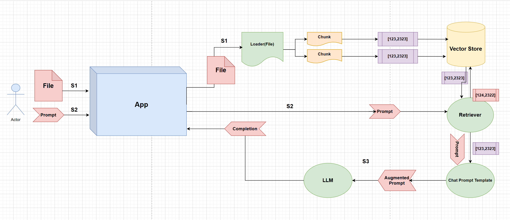

# Semantic Search Engine (RAG)

## Architecture Diagram



## Overview
This project is a simple Semantic Search Engine built using:

- Streamlit
- LangChain
- Google Gemini Embeddings
- Gemini 2.5 Flash
- ChromaDB Vector Store

The application allows users to upload a PDF document, store its content as embeddings in a vector database, and ask questions about the uploaded document using Retrieval-Augmented Generation (RAG).

---

## Architecture

The system follows a RAG (Retrieval-Augmented Generation) workflow:

1. User uploads a PDF file.
2. PDF is loaded using `PyPDFLoader`.
3. Text is split into chunks using `RecursiveCharacterTextSplitter`.
4. Each chunk is converted into vector embeddings using Gemini Embeddings.
5. Embeddings are stored in ChromaDB.
6. User enters a question.
7. Retriever finds the most relevant chunks from ChromaDB.
8. Retrieved context is combined with the user question.
9. Gemini 2.5 Flash generates the final answer.
10. Response is displayed in Streamlit.

---

## Tech Stack

| Component | Technology |
|------------|------------|
| UI | Streamlit |
| Document Loader | PyPDFLoader |
| Chunking | RecursiveCharacterTextSplitter |
| Embeddings | Gemini Embeddings |
| Vector Database | ChromaDB |
| LLM | Gemini 2.5 Flash |
| Framework | LangChain |

---

## Project Flow

### File Processing (S1)
- Upload PDF
- Load document
- Create chunks
- Generate embeddings
- Store vectors in ChromaDB

### Query Processing (S2)
- User submits prompt
- Retriever performs similarity search
- Relevant chunks are fetched

### Answer Generation (S3)
- Retrieved chunks are added to prompt
- Prompt is sent to Gemini
- Gemini generates final response

---

## Installation

```bash
pip install streamlit
pip install langchain
pip install langchain-community
pip install langchain-google-genai
pip install langchain-chroma
pip install chromadb
pip install pypdf
pip install python-dotenv
```

---

## Run Application

```bash
streamlit run app.py
```

---

## Environment Variables

Create a `.env` file:

```env
GOOGLE_API_KEY=YOUR_API_KEY
```

---

## Features

- PDF Upload
- Semantic Search
- Vector Database Storage
- Retrieval-Augmented Generation (RAG)
- Gemini Integration
- Streamlit UI

---

## Future Improvements

- Multiple document support
- Chat history memory
- Hybrid search
- Metadata filtering
- Source citations
- Streaming responses
- 
